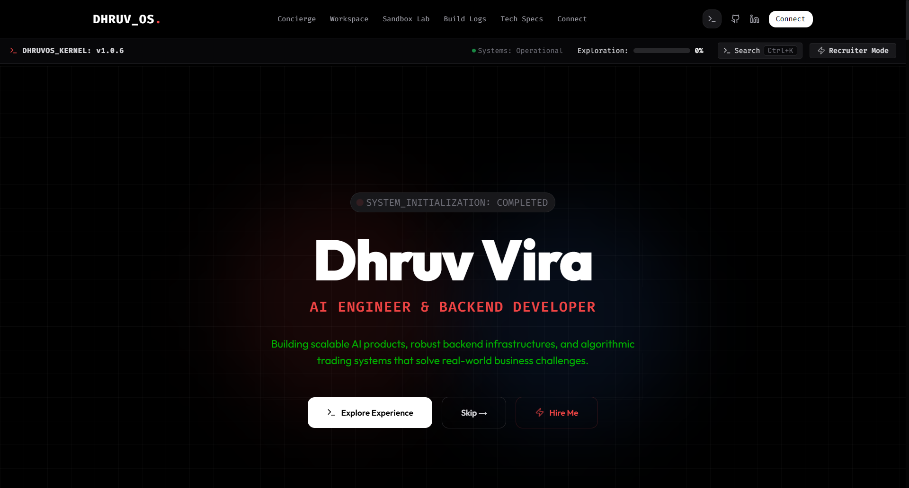
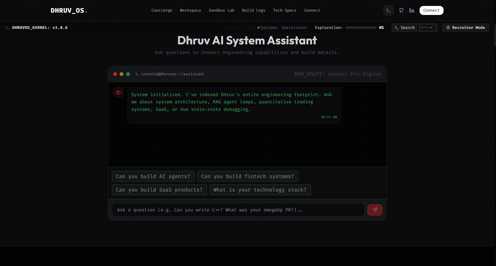
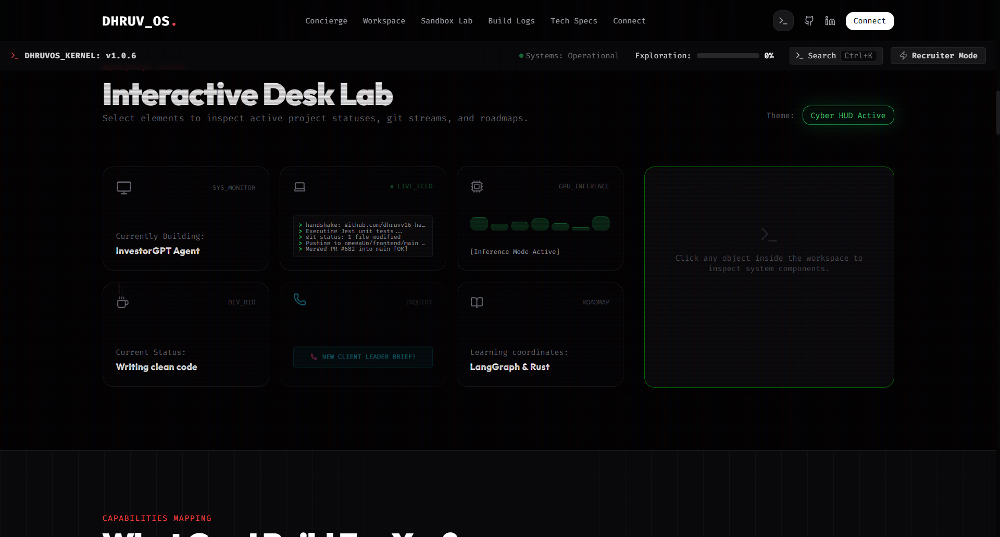
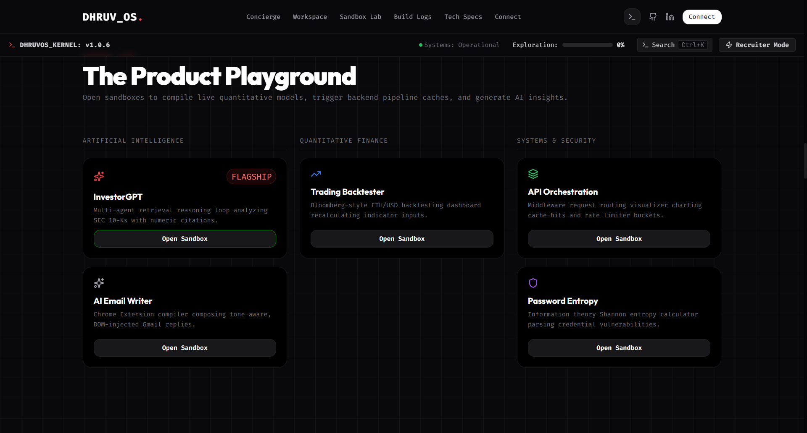
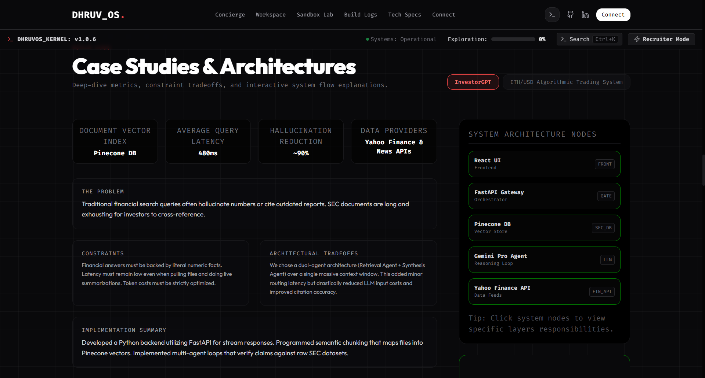
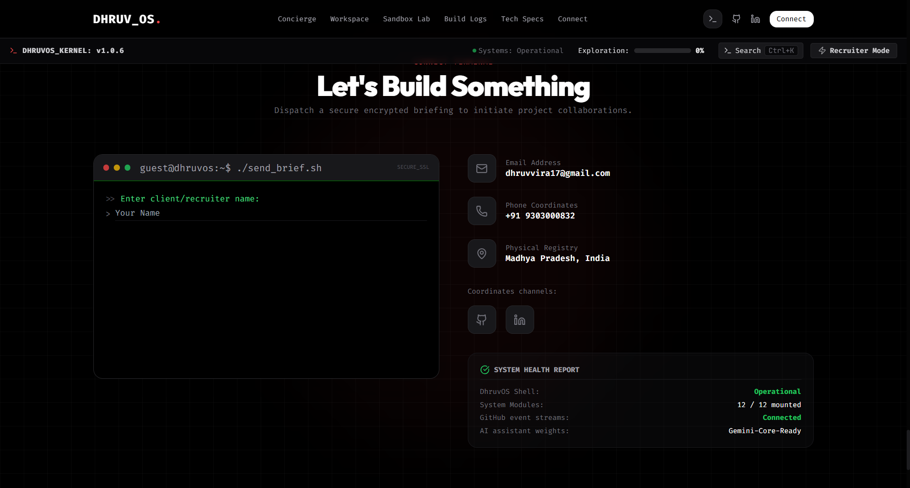

# DhruvOS - Interactive AI & Backend Engineering Portfolio

DhruvOS is a premium, metadata-driven developer portfolio designed like an interactive operating system. It demonstrates software engineering principles, live quantitative sandboxes, system architecture diagrams, and open-source contributions.

---

## 📸 Portfolio Walkthrough & Screenshots

Here is a visual breakdown of the key modules and layers implemented in DhruvOS:

### 1. Identity Layer (Hero Section)
The gateway interface featuring high-contrast typography, interactive CTAs, and options to explore the experience or load the Recruiter ATS view instantly.



---

### 2. System Concierge (AI Assistant)
A terminal-style AI concierge chatbot featuring conversational continuity state tracking. Recruiters can ask about C++, FastAPI, quant systems, or Vue reactive states and inspect organic responses.



---

### 3. Developer Desk (Interactive Workspace)
A live schematic workspace featuring hover-reactive animated coffee steam, dynamic GPU inference graphs, phone notifications feed, and laptop CLI log streams.



---

### 4. Product Playground (Sandbox Labs)
Exposes live interactive sandboxes including InvestorGPT RAG citations, Trading indicators, API gateway token buckets, and information theory Shannon entropy calculators.



---

### 5. Build Logs (Architecture Explorer & Case Studies)
Clickable system nodes (Frontend -> Gateway -> LLM -> Vector DB -> Financial API) explaining engineering tradeoffs, constraints, and business outcomes.



---

### 6. Connect Terminal (Contact Console)
An interactive secure SSL progressive command line form for recruiters and clients to dispatch project briefing payloads.



---

## 🚀 Key Engineering Polish

1. **Code Splitting & Performance**: 
   - Utilizes `React.lazy` and named async chunking to slice the main JS bundle size from **918 KB** to **444 KB**, speeding up Time-to-First-Byte (TTFB).
2. **Factual Telemetry Explorer**:
   - Tracks actual user interactions (e.g. sandbox trials, commands typed, nodes inspected) to update the explorer progress meter dynamically.
3. **Model Context Protocol (MCP) Simulator**:
   - Simulates IPC Stdin/Stdout JSON-RPC frame transfers over IPC channels.
4. **Dynamic Web Vitals HUD**:
   - Captures active browser performance entries to log DOM interactive boot timings.

---

## 🛠️ Installation & Setup

1. **Install Dependencies**:
   ```bash
   npm install
   ```
2. **Run Local Dev Server**:
   ```bash
   npm run dev
   ```
3. **Verify Production Compile Build**:
   ```bash
   npm run build
   ```
